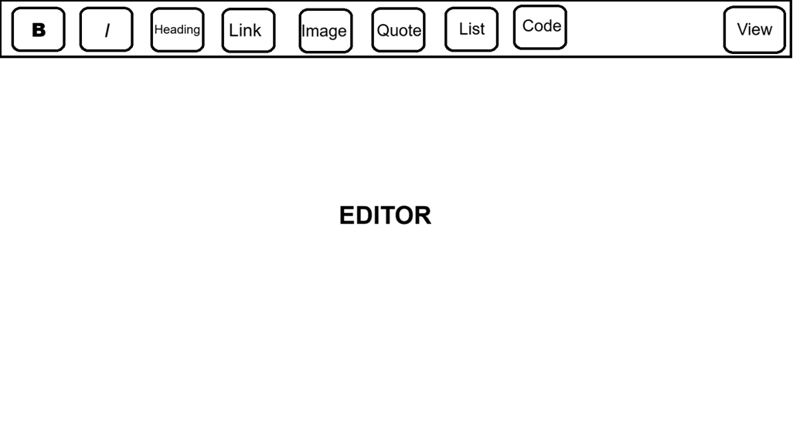

# Outline
This is a WYSIWYG Markdown editor built with React and TypeScript.
As this is a WYSIWYG editor, the text will be formatted instead of just showing the raw markup. This is done with [commonmark.js](https://github.com/commonmark/commonmark.js).

## Features
* Toolbar
  - Formatting buttons
    * Bold
    * Italic
    * Headings 1-3
    * Link
    * Image
    * Quote
    * Unordered and ordered lists
    * Inline and block code
  - View raw markup button
* The editor itself

## Mockup
Below is an INCREDIBLY rough mockup of wysiwyg.md. The buttons to the right of `Heading` will have icons, and the `Heading`, `List`, and `Code` buttons will have a dropdown menu to choose between e.g. unordered and ordered.

